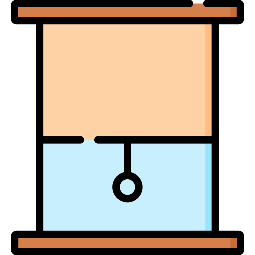

# Adaptive Cover

This Custom-Integration provides sensors for vertical and horizontal blinds based on the sun's position by calculating the position to filter out direct sunlight.

This integration builds upon the template sensor from this forum post [Automatic Blinds](https://community.home-assistant.io/t/automatic-blinds-sunscreen-control-based-on-sun-platform/)

- [Adaptive Cover](#adaptive-cover)
  - [Features](#features)
  - [Installation](#installation)
    - [HACS (Recommended)](#hacs-recommended)
    - [Manual](#manual)
  - [Setup](#setup)
  - [Cover Types](#cover-types)
  - [Modes](#modes)
    - [Basic mode](#basic-mode)
    - [Climate mode](#climate-mode)
      - [Climate strategies](#climate-strategies)
  - [Variables](#variables)
    - [Common](#common)
    - [Vertical](#vertical)
    - [Horizontal](#horizontal)
    - [Tilt](#tilt)
    - [Automation](#automation)
    - [Climate](#climate)
  - [Entities](#entities)
  - [Features Planned](#features-planned)
    - [Simulation](#simulation)
    - [Blueprint (deprecated since v1.0.0)](#blueprint-deprecated-since-v100)

## Features

- Individual service devices for `vertical`, `horizontal` and `tilted` covers
- Two mode approach with multiple strategies [Modes(`basic`,`climate`)](https://github.com/basbruss/adaptive-cover?tab=readme-ov-file#strategy)
- Binary Sensor to track when the sun is in front of the window
- Sensors for `start` and `end` time
- Auto manual override detection

- **Climate Mode**

  - Weather condition based operation
  - Presence based operation
  - Switch to toggle climate mode
  - Sensor for displaying the operation modus (`winter`,`intermediate`,`summer`)

- **Adaptive Control**

  - Turn control on/off
  - Control multiple covers
  - Set start time to prevent opening blinds while you are asleep
  - Set minimum interval time between position changes
  - set minimum percentage change

## Installation

### HACS (Recommended)

Add <https://github.com/basbruss/adaptive-cover> as custom repository to HACS.
Search and download Adaptive Cover within HACS.

Restart Home-Assistant and add the integration.

### Manual

Download the `adaptive_cover` folder from this github.
Add the folder to `config/custom_components/`.

Restart Home-Assistant and add the integration.

## Setup

Adaptive Cover supports (for now) three types of covers/blinds; `Vertical` and `Horizontal` and `Venetian (Tilted)` blinds.
Each type has its own specific parameters to setup a sensor. To setup the sensor you first need to find out the azimuth of the window(s). This can be done by finding your location on [Open Street Map Compass](https://osmcompass.com/).

## Cover Types

|          | Vertical | Horizontal | Tilted  |
|----------|----------|------------|---------|
|          |    |            |         |
| **Movement** | Up/Down  | In/Out     | Tilting |
|  | [variables](#vertical)  | [variables](#horizontal)    | [variables](#tilt)  |

## Modes

This component supports two strategy modes: A `basic` mode and a `climate comfort/energy saving` mode that works with presence and temperature detection.

```mermaid
    flowchart LR
        A[Sundata] --> B{Normal}
        A --> C{Climate}

        B --> |Sun not infront| D{Default}
        B --> |Sun infront| E(Calculated Position)

        D --> H(Default Position)
        D --> |Between sunset and sunrise|I(Sunset Default Position)

        C --> F[No Presence]
        C --> G[Presence]
        G --> B

        F --> M(Check weather)
        M --> N(Conditions False)
        M --> O(Conditions True)

        O --> |Below minimal comfort temperature|K(Fully Open)
        O --> |Above maximal comfort temperature|L(Fully Closed)
        O --> |Inbetween comfort temperature thresholds |D
        N --> D
```

### Basic mode

This mode uses the calculated position when the sun is within the specified azimuth range of the window. Else it defaults to the default value or after sunset value depending on the time of day.

### Climate mode

This mode calculates the position based on extra parameters for presence, indoor temperature, minimal comfort temperature, maximum comfort temperature and weather (optional).
This mode is split up in two types of strategies; [Presence](https://github.com/basbruss/adaptive-cover?tab=readme-ov-file#presence) and [No Presence](https://github.com/basbruss/adaptive-cover?tab=readme-ov-file#no-presence).

#### Climate strategies

- **No Presence**:
Providing daylight to the room is no objective if there is no presence.

  - **Below minimal comfort temperature**:
If the sun is above the horizon and the indoor temperature is below the minimal comfort temperature it opens the blind fully or tilt the slats to be parallel with the sun rays to allow for maximum solar radiation to heat up the room.

  - **Above maximum comfort temperature**:
    The objective is to not heat up the room any further by blocking out all possible radiation. All blinds close fully to block out light.    
    If the indoor temperature is between both thresholds the position defaults to the set default value based on the time of day.

- **Presence**:
The objective is to reduce glare while providing daylight to the room. All calculation is done by the basic model for Horizontal and Vertical blinds.    
If you added a weather entity than it will only use the above calculations if the weather state corresponds with the existence of direct sun rays. These states are `sunny`,`windy` and `partlycloudy`. If not equal to these states the position will default to the default value to allow more sunlight entering the room with minimizing the glare due to the weather condition.   
Tilted blinds will only defect from the above approach if the inside temperature is above the maximum comfort temperature. Than the slats will be positioned at 45 degrees as this is [founded optimal](https://www.mdpi.com/1996-1073/13/7/1731).

## Variables

### Common

|     Variables     | Default| Range | Description |
|----------|----------|------------|---------|
| Entities  |  [] |   | Denotes entities controllable by the integration   |
| Window Azimuth  | 180 | 0-359  | The compass direction of the window, discoverable via [Open Street Map Compass](https://osmcompass.com/) |
| Default Position | 60  |0-100   | Initial position of the cover in the absence of sunlight glare detection  |
| Maximum Position | 100 |1-100   | Maximum opening position for the cover, suitable for partially opening certain cover types  |
| Field of view Left  | 90 | 1-90  | Unobstructed viewing angle from window center to the left, in degrees  |
| Field of view Right | 90  | 1-90  | Unobstructed viewing angle from window center to the right, in degrees  |
| Default position after Sunset | 0 | 0-100  | Cover's default position from sunset to sunrise  |
| Offset Sunset time | 0  |   | Additional minutes before/after sunset |
| Offset Sunrise time  | 0 |   | Additional minutes before/after sunrise |
| Inverse State | False |   | Calculates inverse state for covers fully closed at 100% |

### Vertical

|     Variables     | Default| Range | Description |
|----------|----------|------------|---------|
|  Window Height |  2.1 | 0.1-6  | Length of fully extended cover/window  |
|  Workarea Distance | 0.5 | 0.1-2 | The distance to the workarea on equal height to the bottom of the cover when fully extended  |

### Horizontal

|     Variables     | Default| Range | Description |
|----------|----------|------------|---------|
| Awning Height  |  2 |  0.1-6 | Height from work area to awning mounting point |
| Awning Length (horizontal)  |  2.1 |  0.3-6 | Length of the awning when fully extended  |
| Awning Angle  | 0  | 0-45  |  Angle of the awning from the wall |
| Window Height |  2.1 | 0.1-6  | Height of the window when fully extended  |
| Workarea Distance | 0.5 | 0.1-2 | Distance to the work area  |

### Tilt

|     Variables     | Default| Range | Description |
|----------|----------|------------|---------|
| Slat Depth  | 3  | 0.1-15  |  Width of each slat |
| Slat Distance  | 2  | 0.1-15 | Vertical distance between two slats in horizontal position |
| Tilt Mode | Bi-directional  |   |   |

### Automation

|     Variables     | Default| Range | Description |
|----------|----------|------------|---------|
| Minimum Delta Position  | 1  | 90 | Minimum position change required before another change can occur  |
| Minimum Delta Time  | 2 |   |  Minimum time gap between position change |
| Start Time  | `"00:00:00"` |   | Earliest time a cover can be adjusted after midnight   |
| Start Time Entity  | None |   | The earliest moment a cover may be changed after midnight. *Overrides the `start_time` value*  |
| Manual Override Duration | `15 min` |   | Minimum duration for manual control status to remain active  |
| Manual Override reset Timer  | False |   |  Resets duration timer each time the position changes while the manual control status is active  |

### Climate

|     Variables     | Default| Range |Example| Description |
|----------|----------|------------|---------|---------|
| Indoor Temperature Entity  | `None`  |   | `climate.living_room` \| `sensor.indoor_temp`  |    |
| Minimum Comfort Temperature  | 21 | 0-86 |   |    |
| Maximum Comfort Temperature  | 25 | 0-86 |   |    |
| Outdoor Temperature Entity  |  `None` |   | `sensor.outdoor_temp`  |   |
| Presence Entity  |  `None` |   |   |  |
| Weather Entity  | `None`  |   |  `weather.home` | Can also serve as outdoor temperature sensor  |

## Entities

The integration adds dynamically based on the used features multiple entities.

These entities are always available:
| Entities                                      | Default        | Description                                                                                                            |
| --------------------------------------------- | -------------- | ---------------------------------------------------------------------------------------------------------------------- |
| `sensor.{type}_cover_position_{name}`         |                | Reflects the current state determined by predefined settings and factors such as sun position, weather, and temperature   |
| `sensor.{type}_control_method_{name}`         | `intermediate` | Indicates the active control strategy based on weather conditions. Options include `winter`, `summer`, and `intermediate` |
| `sensor.{type}_start_sun_{name}`              |                | Shows the starting time when the sun enters the window's view, with an interval of every 5 minutes..               |
| `sensor.{type}_end_sun_{name}`                |                | Indicates the ending time when the sun exits the window's view, with an interval of every 5 minutes.         |
| `binary_sensor.{type}_manual_override_{name}` | `off`          | Indicates if manual override is engaged for any blinds.                             |
| `binary_sensor.{type}_sun_infront_{name}`     | `off`          | Indicates whether the sun is in front of the window within the designated field of view.              |
| `switch.{type}_toggle_control_{name}`     | `on`          | Activates the adaptive control feature. When enabled, blinds adjust based on calculated position, unless manually overridden.                         |
| `switch.{type}_manual_override_{name}`     | `on`          | Enables detection of manual overrides. A cover is marked if its position differs from the calculated one, resetting to adaptive control after a set duration.                   |
| `button.{type}_reset_manual_override_{name}`     | `on`          | Resets manual override tags for all covers; if `switch.{type}_toggle_control_{name}` is on, it also restores blinds to their correct positions.      |

When climate mode is setup you will also get these entities:

| Entities                                      | Default        | Description                                                                                                            |
| --------------------------------------------- | -------------- | ---------------------------------------------------------------------------------------------------------------------- |
| `switch.{type}_climate_mode_{name}`         |        `on`      | Enables climate mode strategy; otherwise, defaults to the standard strategy.   |
| `switch.{type}_outside_temperature_{name}`         |        `on`      | Switches between inside and outside temperatures as the basis for determining the climate control strategy.   |

## Features Planned

- Manual override controls
  - ~~Time to revert back to adaptive control~~
  - ~~Reset button~~
  - Wait until next manual/none adaptive change

- Algorithm to control radiation and/or illumination

### Simulation

### Blueprint (deprecated since v1.0.0)

This integration provides the option to download a blueprint to control the covers automatically by the provide sensor.
By selecting the option the blueprints will be added to your local blueprints folder.
