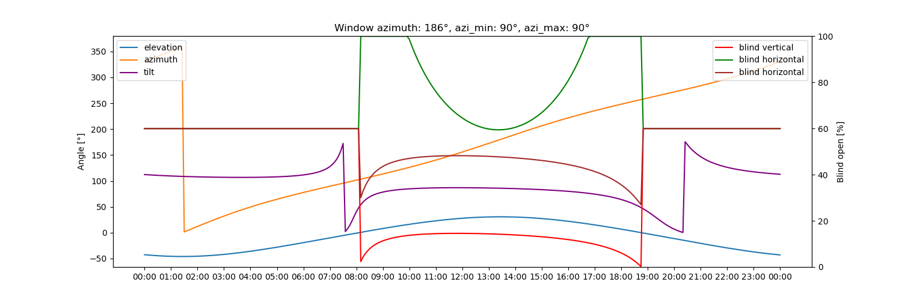

# Adaptive Cover

This Custom-Integration provides sensors for vertical and horizontal blinds based on the sun's position by calculating the position to filter out direct sunlight.

This integration builds upon the template sensor from this forum post [Automatic Blinds](https://community.home-assistant.io/t/automatic-blinds-sunscreen-control-based-on-sun-platform/)

## Features

- Individual service devices for `vertical`, `horizontal` and `tilted` covers
- Two mode approach with multiple strategies [Modes(`basic`,`climate`)](https://github.com/basbruss/adaptive-cover?tab=readme-ov-file#strategy)
- Binary Sensor to track when the sun is in front of the window
- Sensors for `start` and `end` time

- **Climate Mode**

    - Weather condition based operation
    - Presence based operation
    - Switch to toggle climate mode
    - Sensor for displaying the operation modus (`winter`,`intermediate`,`summer`)

## Installation

### HACS (Recommended)

Add https://github.com/basbruss/adaptive-cover as custom repository to HACS.
Search and download Adaptive Cover within HACS.

Restart Home-Assistant and add the integration.

### Manual

Download the `adaptive_cover` folder from this github.
Add the folder to `config/custom_components/`.

Restart Home-Assistant and add the integration.

## Setup

Adaptive Cover supports (for now) three types of covers/blinds; `Vertical` and `Horizontal` and `Venetian (Tilted)` blinds.
Each type has its own specific parameters to setup a sensor. To setup the sensor you first need to find out the azimuth of the window(s). This can be done by finding your location on [Open Street Map Compass](https://osmcompass.com/).

## Modes

This component supports two strategy modes: A `basic` mode and a `climate comfort/energy saving` mode that works with presence and temperature detection.

### Basic mode

This mode uses the calculated position when the sun is within the specified azimuth range of the window. Else it defaults to the default value or after sunset value depending on the time of day.

### Climate mode

This mode calculates the position based on extra parameters for presence, indoor temperature, minimal comfort temperature, maximum comfort temperature and weather (optional).
This mode is split up in two types of strategies; [Presence](https://github.com/basbruss/adaptive-cover?tab=readme-ov-file#presence) and [No Presence](https://github.com/basbruss/adaptive-cover?tab=readme-ov-file#no-presence).

#### Climate strategies
- **No Presence**:
Providing daylight to the room is no objective if there is no presence.

    - **Below minimal comfort temperature**:
If the sun is above the horizon and the indoor temperature is below the minimal comfort temperature it opens the blind fully or tilt the slats to be parallel with the sun rays to allow for maximum solar radiation to heat up the room.

    - **Above maximum comfort temperature**:
    The objective is to not heat up the room any further by blocking out all possible radiation. All blinds close fully to block out light.    
    If the indoor temperature is between both thresholds the position defaults to the set default value based on the time of day.

- **Presence**:
The objective is to reduce glare while providing daylight to the room. All calculation is done by the basic model for Horizontal and Vertical blinds.    
If you added a weather entity than it will only use the above calculations if the weather state corresponds with the existence of direct sun rays. These states are `sunny`,`windy` and `partlycloudy`. If not equal to these states the position will default to the default value to allow more sunlight entering the room with minimizing the glare due to the weather condition.   
Tilted blinds will only defect from the above approach if the inside temperature is above the maximum comfort temperature. Than the slats will be positioned at 45 degrees as this is [founded optimal](https://www.mdpi.com/1996-1073/13/7/1731).

```mermaid
    flowchart LR
        A[Sundata] --> B{Normal}
        A --> C{Climate}

        B --> |Sun not infront| D{Default}
        B --> |Sun infront| E(Calculated Position)

        D --> H(Default Position)
        D --> |Between sunset and sunrise|I(Sunset Default Position)

        C --> F[No Presence]
        C --> G[Presence]
        G --> B

        F --> M(Check weather)
        M --> N(Conditions False)
        M --> O(Conditions True)

        O --> |Below minimal comfort temperature|K(Fully Open)
        O --> |Above maximal comfort temperature|L(Fully Closed)
        O --> |Inbetween comfort temperature thresholds |D
        N --> D
```

### Simulation

### Blueprint

This integration provides the option to download a blueprint to control the covers automatically by the provide sensor.
By selecting the option the blueprints will be added to your local blueprints folder.
